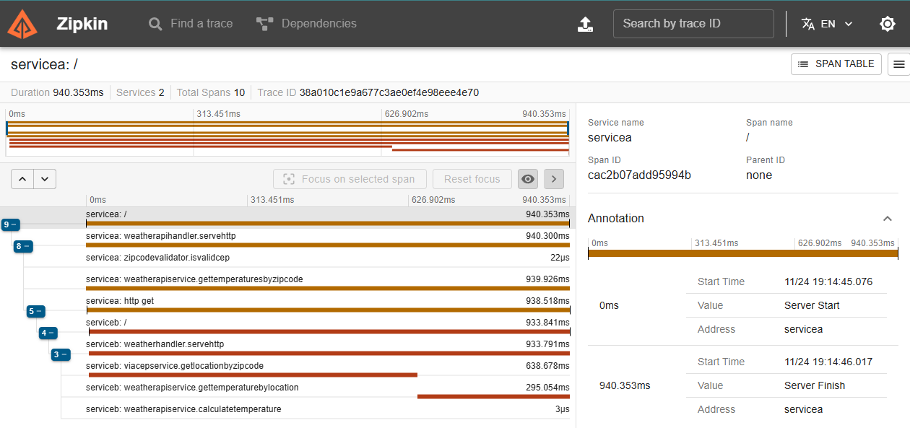

# Microservices Weather API

This project implements a system to retrieve temperature data by CEP (Brazilian postal code). It consists of two microservices: **Service A** and **Service B**. The system is containerized using Docker and includes OpenTelemetry for distributed tracing with Zipkin.



## Table of Contents

- [Features](#features)
- [Requirements](#requirements)
- [Installation](#installation)
- [API Responses](#api-responses)
- [Notes](#notes)

## Features

- **Service A**: Accepts a CEP via POST, validates the input, and forwards valid requests to Service B.
- **Service B**: Retrieves the city for a given CEP using the viaCEP API, fetches temperature data using the WeatherAPI, and returns the data in Celsius, Fahrenheit, and Kelvin.

## Requirements

- Docker
- Docker Compose
- A valid WeatherAPI key ([get it here](https://www.weatherapi.com/))

## Installation

1. **Clone the Repository**

   ```bash
   git clone https://github.com/Twsouza/microservices-weather-api
   cd microservices-weather-api
   ```

2. **Set the WeatherAPI Key**

  Set the WeatherAPI key in the `.env` file:

   ```bash
   copy .env.example .env
   echo "WEATHER_API_KEY=your_key_here" >> .env
   ```

3. Run docker-compose

   ```bash
   docker-compose up
   ```

## Zipkin UI

Access the Zipkin UI at `http://localhost:9411/zipkin/` to view the traces.

## API Responses

### Service A

- **Invalid CEP (format)**:
  - HTTP Status: `422`
  - Response: `invalid zipcode`

- **Forward to Service B**:
  - HTTP Status: `200`
  - Response: Depends on Service B.

### Service B

- **Successful Response**:
  - HTTP Status: `200`
  - Response:

    ```json
    {
      "city": "São Paulo",
      "temp_C": 28.5,
      "temp_F": 83.3,
      "temp_K": 301.65
    }
    ```

- **Invalid CEP (format)**:
  - HTTP Status: `422`
  - Response: `invalid zipcode`

- **Non-existent CEP**:
  - HTTP Status: `404`
  - Response: `can not find zipcode`

## Notes

- Ensure the WeatherAPI key is correctly set in the serviceb `.env`.
- The application is designed to work with valid Brazilian postal codes (8 digits).
